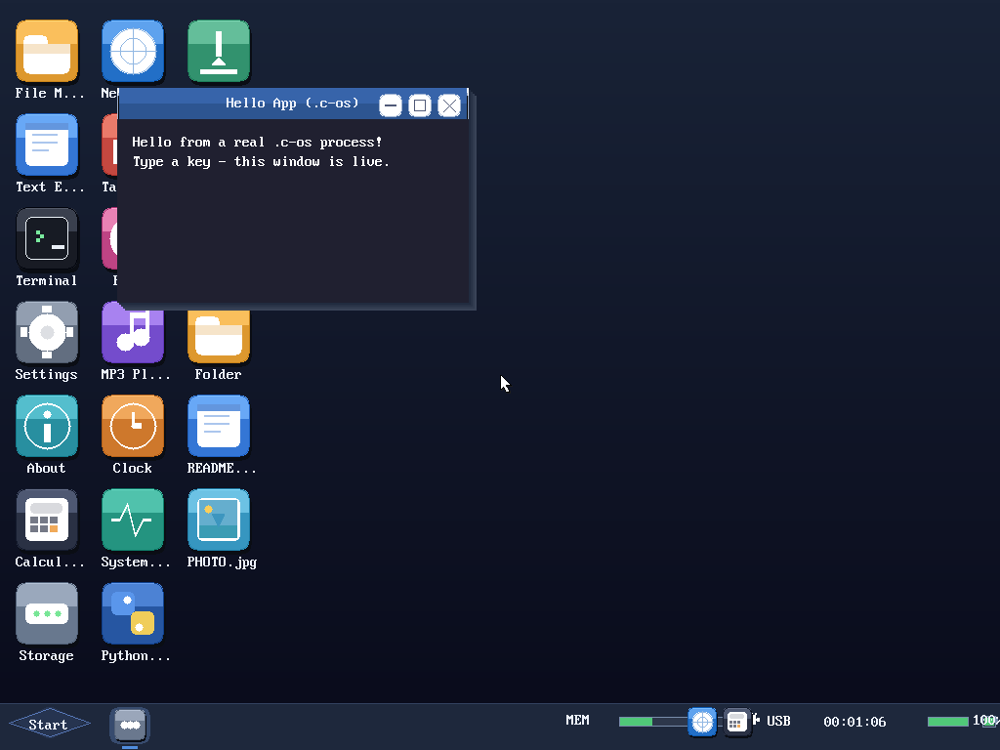

# Server/ — C-OS userspace servers

## What this is

C-OS deliberately takes the "best of both worlds" from microkernel design
rather than a full rewrite: subsystems that genuinely benefit from
isolation move to userspace; the scheduler, paging, interrupt handling,
and the graphics hot path stay in the kernel, because moving those costs
real performance for little safety benefit on a single-user desktop OS.
This folder is where the userspace half of that split lives.

Every program here is an ordinary ring3 process, built with the same
`cos-cc` toolchain as any other C-OS userspace program (see
`tools/cos-cc`), talking to clients and to the kernel only through public
syscalls - `SYS_IPC_*` for message passing and shared memory (see
`src/kernel/syscall.c` and `docs/STACK_OVERFLOW_INVESTIGATION.md` section
10 for how that gate came to exist), plus whatever ordinary syscalls
(`SYS_READ_FILE`, etc.) a given server needs to do its job.

## Layout

```
Server/
  fileserver/       - the file server itself (source + prebuilt .c-os)
  testclients/       - standalone test clients that exercise a server
                       end-to-end through the real syscall boundary,
                       not just the layer beneath it
  apps/              - real, standalone .c-os GUI APPLICATIONS - not
                       servers, not test clients, but actual programs a
                       user would open (see hello_app below for the
                       first one, and what it proves)
```

A new server gets its own subdirectory here, named after what it does.
Its test client(s), if any, go in `testclients/` rather than living next
to the server - a client proves the server's *public* protocol works
from an ordinary, unprivileged, independently-scheduled process, and
mixing them together invites the client to reach into the server's
internals instead of going through IPC like any other caller would have
to. A real GUI application - one that opens its own window and reacts to
input, as opposed to answering another process's requests - goes in
`apps/` instead.

## fileserver — read-only file access over IPC

`fileserver/fileserver.c` is deliberately narrow in scope, and the scope
is stated plainly rather than implied: it answers `FS_MSG_READ` requests
by calling the kernel's own `cos_read_file()` (i.e. the existing FatFs
path via `SYS_READ_FILE`) and sending the content back over IPC. It does
**not** replace the kernel's own filesystem code, and does not attempt
to.

That is a real, deliberate limit, not a shortcut taken for lack of time.
Moving FatFs itself into a process - so a corrupt filesystem image can
corrupt only that process, not the kernel - is the actual isolation win
a file server should eventually provide, and doing it properly runs
straight into a real bootstrapping problem: the very first userspace
process's ELF image has to be read from disk by *something*, before any
userspace file server exists to serve that read. Get the ordering wrong
and the failure mode is not "this one feature doesn't work" - it is "the
OS no longer boots," which is a categorically worse outcome than any bug
this project has fixed so far. `fileserver.c` exists to prove the IPC
*pattern* - a real server process answering a real client process,
entirely through the syscall boundary - on ground safe enough that
getting it wrong costs one feature, not the ability to boot at all.
Migrating FatFs itself underneath this server is real, valuable future
work; it needs the disk driver reachable from userspace (or a block
server underneath this one) and a considered answer to the bootstrap
ordering question first.

**Protocol** (see the full comment in `fileserver.c` for the exact wire
format): `FS_MSG_READ` with a NUL-terminated path as the payload;
`FS_MSG_SHUTDOWN` to stop the server cleanly. Responses go through
`cos_ipc_respond()`, whose wire format prepends an 8-byte status ahead of
any payload - not a separate field `cos_ipc_recv()` hands back, which is
easy to get wrong once and is exactly the bug `testclients/fileclient.c`
had to be fixed to avoid (see its own comments).

**Verified for real**, not just described: `COS_VALIDATION_FILESERVER_TEST`
(off by default) spawns both processes at boot and lets them run through
the scheduler like any other two programs would. Confirmed booting:

```
[USERSPACE] launched fileserver.c-os pid=2 entry=0x00000080000011C0
[fileclient] read-roundtrip OK
[fileclient] missing-file NOT_FOUND OK
[fileclient] PASSED
[fileserver] shutdown requested, exiting
```

## apps/hello_app — the first real, standalone .c-os GUI application

`apps/hello_app.c` is what actually answers the standing question this
project kept circling back to: *if a built-in app (Calculator, About,
...) becomes a real separate process, does opening it from the desktop
still work the same way?* It does - this proves it, not just argues it.

It uses two things that already existed in this codebase before this
was written, correctly, but that nothing had ever actually exercised
together end to end:

* **`cos_win_create`/`cos_win_fill`/`cos_win_text`/`cos_win_poll_key`**
  (`userland/include/cos.h`) - thin wrappers over five `SYS_WIN_*`
  syscalls (`src/kernel/syscall.c`) that let a ring3 process own a
  `WIN_COS_APP` window: the desktop's own compositor
  (`cos_app_window_draw()`, `src/kernel/cos_app_window.c`) paints
  whatever `fill_rect`/`draw_text` commands the process has queued,
  using its own font renderer, every frame - the app never touches a
  pixel buffer or a font directly.
* **`gui_open_file_in_app()` → `cos_launch_elf_file()`**
  (`src/gui/apps/common/gui_apps_common.c`) - the exact call a user
  double-clicking a `.c-os` file in the file manager already triggers.
  `hello_app.c-os` is seeded onto the real FAT32 volume at boot
  (`spawn_cos_hello_app_test()`, `src/kernel/userspace_demo.c`) and
  opened through this same path, deliberately not the
  embedded-byte-array spawn every other test program in this tree uses -
  the whole point is proving the on-disk, double-click-shaped path works
  for a real GUI app, not just a headless one.

**Verified visually, not just by absence of a crash**: booted with QMP
attached, the seed-and-open sequence run, and the actual framebuffer
captured via `screendump`.



A second capture, after sending real keypresses through QMP, confirms
the interactive half works too - keyboard input reaching a real,
separate ring3 process and that process redrawing in response:


Zero exceptions in either case; the full host suite, the file-server
round trip, and a default production boot with the GUI cursor fast path
were all re-confirmed unaffected by adding this.


1. Write it against `userland/include/cos.h` - the same header every
   other C-OS userspace program uses. `cos_ipc_recv()` in a loop is the
   standard shape: block for a request, dispatch on `msg_type`, answer
   with `cos_ipc_respond()`.
2. Compile with `cos-cc -o Server/<name>/<name>.c-os Server/<name>/<name>.c`
   and commit the resulting `.c-os` binary alongside its source - this
   tree embeds programs as pre-built binaries (see the `VALIDATION_HEADERS`
   section of the root `Makefile`), so nothing at kernel-build time
   depends on having a userspace cross-compiler available.
3. Add a `gen_cos_program.py` rule in the `Makefile` (copy an existing
   one under `# fileserver.c-os / fileclient.c-os` and adjust the paths
   and symbol name) and a spawn function in `src/kernel/userspace_demo.c`
   following `spawn_cos_fileserver_test()`'s shape, gated behind its own
   `COS_VALIDATION_*` flag so a normal boot never launches it unasked.
4. If it needs a test client, put one in `testclients/` and make it
   prove the real protocol from a real separate process - a kernel-side
   test that calls the server's own functions directly (the way
   `COS_VALIDATION_IPC_TEST` proves the IPC layer beneath the syscalls,
   separately from this) is valuable too, but it is not a substitute for
   this: it cannot catch a syscall-marshalling bug, only a client
   actually crossing that boundary can.

## What is intentionally not here (yet)

A GUI server, a network protocol server, and moving FatFs itself
underneath `fileserver` are all real, valuable candidates for this same
treatment. None are attempted yet: each has a materially larger surface
and, in the GUI and network cases, touches code this session already
found to be delicate (the redraw-trigger and scheduling work in
`docs/STACK_OVERFLOW_INVESTIGATION.md` sections 7-8). Extending this
folder is expected; doing so by copying `fileserver`'s scope discipline -
state plainly what is and is not covered - matters more than covering
everything at once.
